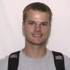
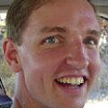

## Uncategorized

-   { width=200px }

    **Evan Andersen**

    **Degree**: MS Electrical Engineering

    **Email**: andersen.evan@gmail.com

-   { width=200px }

    **Jeff Anderson**

    **Degree**: MS Electrical Engineering

    **Email**: jda064@gmail.com

-   **Matthew Argyle**

    **Degree**: PhD Electrical Engineering

    **Email**: matt.argyle@gmail.com

-   { width=200px }

    **Blake Barber**

    **Degree**: MS Electrical Engineering

    **Email**: d.blake.barber@gmail.com

-   { width=200px }

    **Jason Beach**

    **Degree**: MS Electrical Engineering

    **Email**: jmbeach@byu.edu

-   **Ian Beaty**

    **Degree**: BS Electrical Engineering

    **Email**: grnhrnt@byu.net

-   { width=200px }

    **Jacob Bishop**

    **Degree**: MS Mechanical Engineering

    **Email**: bishop.jacob@byu.edu

-   { width=200px }

    **Tanner Norton**

    **Degree**: MS Computer Science

    **Email**: tannort5@byu.edu

-   { width=200px }

    **Thane Downing**

    **Degree**: PhD Electrical and Computer Engineering

    **Email**: downing2@byu.edu

-   { width=200px }

    **Michael Williamson**

    **Degree**: BS Mechanical Engineering

    **Email**: michael.antiproton@protonmail.com

-   { width=200px }

    **Seth Nielsen**

    **Degree**: MS Electrical and Computer Engineering

    **Email**: sethmnielsen@gmail.com

-   { width=200px }

    **Mark Petersen**

    **Degree**: PhD Electrical and Computer Engineering

    **Email**: pet09034@byu.edu

-   { width=200px }

    **Jacob Willis**

    **Degree**: MS Electrical and Computer Engineering

    **Email**: jbwillis272@gmail.com

-   { width=200px }

    **Matthew Rydalch**

    **Degree**: MS Electrical and Computer Engineering

    **Email**: matthewk.rydalch@gmail.com

-   { width=200px }

    **Hayden Morgan**

    **Degree**: MS Electrical and Computer Engineering

    **Email**: haydenmmorgan@gmail.com

-   { width=200px }

    **Jared Yates**

    **Degree**: BS Electrical Engineering

-   { width=200px }

    **Hayden Morgan**

    **Degree**: MS Electrical and Computer Engineering

    **Email**: haydenmmorgan@gmail.com

-   { width=200px }

    **Jesse Wynn**

    **Degree**: MS Mechanical Engineering

    **Email**: wynnsquad@gmail.com

-   { width=200px }

    **Jared Wikle**

    **Degree**: MS Mechanical Engineering

    **Email**: jkwikle@yahoo.com

-   { width=200px }

    **Liang (Solomon) Sun**

    **Degree**: PhD

    **Email**: sun.liang@byu.edu

    **Gerrit Sorensen**

    **Degree**: MS Computer Engineering

    **Email**: gas4@email.byu.edu

-   { width=200px }

    **Rajnikant Sharma**

    **Degree**: PhD Electrical Engineering

    **Email**: rs535@et.byu.edu

-   { width=200px }

    **Jeff Saunders**

    **Degree**: PhD Electrical Engineering

    **Email**: saunders.jeff@gmail.com

    **Josh Sakamaki**

    **Degree**: MS Electrical Engineering

    **Email**: joshsakamaki@gmail.com

-   { width=200px }

    **Laith Sahawneh**

    **Degree**: PhD Electrical and Computer Engineering

    **Email**: laith20@hotmail.com

-   { width=200px }

    **Dale Rowley**

    **Degree**: MS Mechanical Engineering

    **Email**: dale.rowley@perceptekrobotics.com

-   { width=200px }

    **Andres Rodriguez**

    **Degree**: MS Electrical Engineering

    **Email**: andres.rodriguez@byu.edu

-   { width=200px }

    **Brandon Reimschissel**

    **Degree**: BS Electrical Engineering

    **Email**: brandon.reimschissel@gmail.com

-   { width=200px }

    **Joshua Redding**

    **Degree**: MS Mechanical Engineering

    **Email**: jredding@byu.edu

-   { width=200px }

    **Jason Ready**

    **Degree**: MS Computer Science

    **Email**: jmready@gmail.com

-   { width=200px }

    **Bryce Ready**

    **Degree**: PhD Electrical Engineering

    **Email**: bryce.ready@gmail.com

-   { width=200px }

    **Eric Quist**

    **Degree**: PhD Electrical Engineering

    **Email**: eric.quist@gmail.com

-   { width=200px }

    **Morgan Quigley**

    **Degree**: BS Computer Science

    **Email**: morganquigley@gmail.com

-   { width=200px }

    **Bryce Pincock**

    **Degree**: MS Electrical Engineering

    **Email**: bpincock@yahoo.com

-   { width=200px }

    **Rhett Phillips**

    **Degree**: BS Mechanical Engineering

    **Email**: rhetty2roll@hotmail.com

    **Sujit P.B.**

    **Degree**: PhD Electrical Engineering

-   { width=200px }

    **Steve Osborne**

    **Degree**: MS Electrical Engineering

    **Email**: srosborne@gmail.com

-   { width=200px }

    **Paul Nyholm**

    **Degree**: MS Mechanical Engineering

    **Email**: pwnyholm@gmail.com

-   { width=200px }

    **Peter Niedfeldt**

    **Degree**: PhD Electrical Engineering

    **Email**: pcniedfeldt@gmail.com

-   { width=200px }

    **Joe Nichols**

    **Degree**: PhD Electrical Engineering

    **Email**: nichols@byu.edu

-   { width=200px }

    **Derek Nelson**

    **Degree**: MS Mechanical Engineering

    **Email**: derek.nelson@byu.net

-   { width=200px }

    **Jeffrey Millard**

    **Degree**: MS Electrical Engineering

    **Email**: jeffrey.d.millard@gmail.com

-   { width=200px }

    **Brett Millar**

    **Degree**: MS Mechanical Engineering

    **Email**: brett.millar@gmail.com

-   { width=200px }

    **Justin Mackay**

    **Degree**: MS Mechanical Engineering

    **Email**: 1.732mackay@gmail.com

-   { width=200px }

    **John Macdonald**

    **Degree**: PhD Electrical Engineering

    **Email**: johnatbyu@hotmail.com

-   { width=200px }

    **Parker Lusk**

    **Degree**: MS Electrical Engineering

    **Email**: parkerclusk@gmail.com

-   { width=200px }

    **Benjamin Lewis**

    **Degree**: MS Electrical Engineering

    **Email**: benjamin.lewis.1000@gmail.com

-   { width=200px }

    **Robert Leishman**

    **Degree**: PhD Mechanical Engineering

    **Email**: rleish@gmail.com

-   { width=200px }

    **Jae Lee**

    **Degree**: MS Electrical Engineering

    **Email**: jaelee.byu@gmail.com

-   { width=200px }

    **Nathan Knoebel**

    **Degree**: MS Mechanical Engineering

    **Email**: nbk4@byu.edu

-   { width=200px }

    **Robert Klaus**

    **Degree**: MS Mechanical Engineering

    **Email**: robertklaus@byu.net

-   { width=200px }

    **Derek Kingston**

    **Degree**: PhD Electrical Engineering

    **Email**: derek_kingston@hotmail.com

-   { width=200px }

    **Jed Kelsey**

    **Degree**: MS Mechanical Engineering

    **Email**: neil_johnson@byu.edu

-   { width=200px }

    **Walt Johnson**

    **Degree**: MS Electrical Engineering

    **Email**: waltj@procurusuav.com

-   { width=200px }

    **David Johansen**

    **Degree**: MS Electrical Engineering

    **Email**: davejohansen@gmail.com

-   { width=200px }

    **Joe Jackson**

    **Degree**: MS Mechanical Engineering

    **Email**: joseph_jackson@byu.edu

    **Kyle Ingersoll**

    **Degree**: BS Mechanical Engineering: Mechatronics

    **Email**: jkiclimber@gmail.com

-   { width=200px }

    **David Hubbard**

    **Degree**: MS Computer Science

-   { width=200px }

    **Jason Howlett**

    **Degree**: MS Electrical Engineering

    **Email**: holt.ryan@gmail.com

    **Benhamin Heiner**

    **Degree**: MS Electrical Engineering

    **Email**: benjamin.heiner@byu.net

-   { width=200px }

    **Steven Hansen**

    **Degree**: MS Mechanical Engineering

    **Email**: stevenhansen01@yahoo.com

-   { width=200px }

    **James Hall**

    **Degree**: PhD Mechanical Engineering

    **Email**: hallatkj@gmail.com

    **Jeff Ferrin**

    **Degree**: PhD Mechanical Engineering

    **Email**: jeff_ferrin@hotmail.com

-   { width=200px }

    **Andrew Eldredge**

    **Degree**: MS Mechanical Engineering

    **Email**: andrewe@byu.edu

-   { width=200px }

    **Joe Egbert**

    **Degree**: MS Electrical Engineering

    **Email**: jegbert1@gmail.com

-   { width=200px }

    **Nathan Edwards**

    **Degree**: MS Mechanical Engineering

    **Email**: nathanedwards8@gmail.com

-   { width=200px }

    **Matthew Duffield**

    **Degree**: MS Mechanical Engineering and MBA

    **Email**: matt.o.duffield.bsm@gmail.com

-   { width=200px }

    **Patrick DeFranco**

    **Degree**: MS Electrical Engineering

    **Email**: pacadef@gmail.com

-   { width=200px }

    **Reed Christiansen**

    **Degree**: MS Electrical Engineering

    **Email**: reedchristiansen@gmail.com

-   { width=200px }

    **Brandon Carroll**

    **Degree**: MS Electrical Engineering

    **Email**: ctnodnarb@yahoo.com

-   { width=200px }

    **Brandon Cannon**

    **Degree**: MS Mechanical Engineering

    **Email**: brandonjcan@gmail.com

-   { width=200px }

    **Brandon Call**

    **Degree**: MS Mechanical Engineering

    **Email**: brandoncall@gmail.com

-   { width=200px }

    **Everett Bryan**

    **Degree**: MS Electrical Engineering

    **Email**: eabryan@byu.edu

-   { width=200px }

    **Dallin Briggs**

    **Degree**: MS Mechanical Engineering

    **Email**: dallinbriggs@gmail.com

-   { width=200px }

    **Justin Bradley**

    **Degree**: MS Electrical Engineering

    **Email**: jmb275@et.byu.edu

-   { width=200px }

    **Matt Blake**

    **Degree**: MS Electrical Engineering

    **Email**: blakem@ee.byu.edu

## 2025

## 2024

## 2023

## 2022

## 2021

## 2020

## 2019

## 2018

## 2017

## 2016

## 2015

## 2014

## 2013

## 2012

## 2011

## 2010

## 2009

-   { width=200px }

    **David Casbeer**

    **Degree**: PhD Electrical Engineering

    **Email**: dwc8@email.byu.edu

## 2008

-   { width=200px }

    **Andrew Curtis**

    **Degree**: MS Electrical Engineering

    **Email**: byudrew@gmail.com

## 2007

## 2006

-   { width=200px }

    **Josh Matthews**

    **Degree**: MS Electrical Engineering

## 2005

-   { width=200px }

    **Steve Griffiths**

    **Degree**: MS Mechanical Engineering

## 2004

-   { width=200px }

    **David Wheeler**

    **Degree**: MS Mechanical Engineering

    **Email**: dhw6@et.byu.edu

    **Jason Vest**

    **Degree**: MS Mechanical Engineering

    **Email**: jvest@et.byu.edu

-   { width=200px }

    **Wei Ren**

    **Degree**: PhD Electrical Engineering

    **Email**: wren@engineering.usu.edu

-   { width=200px }

    **Joshua Hintze**

    **Degree**: MS Electrical Engineering

    **Email**: jh279@email.byu.edu

## 2003

-   { width=200px }

    **Jason Howlett**

    **Degree**: MS Mechanical Engineering

    **Email**: howlett@et.byu.edu

-   **Steve Olson**

    **Degree**: MS Mechanical Engineering

    **Email**: olsonsa@ee.byu.edu

## 2002

-   { width=200px }

    **Erik Anderson**

    **Degree**: MS Electrical Engineering

    **Email**: eandersn@ee.byu.edu

-   { width=200px }

    **Peter Jones**

    **Degree**: BS Electrical Engineering

    **Email**: jonep@ee.byu.edu

## 2001

-   { width=200px }

    **Jed Kelsey**

    **Degree**: MS Electrical Engineering

    **Kevin Judd**

    **Degree**: MS Electrical Engineering

    **Email**: kevjudd@us.ibm.com

## 2000

    
-   **Brett Young**

    **Degree**: MS Electrical Engineering

    **Email**: brett_j_young@west.raytheon.com
    
    **Jonathan Lawton**

    **Degree**: PhD Electrical Engineering

    **Email**: jonathan_r_lawton@raytheon.com

    **Chad Humberstone**

    **Degree**: MS Mechanical Engineering

    **Email**: chad@byu.net

## 1999

-   **Chris Bailey**

    **Degree**: MD Electrical Engineering

    **Email**: cbailey@orem.verio.net

    **Tim Gold**

    **Degree**: MS Mechanical Engineering

    **Email**: tgold@byu.net

