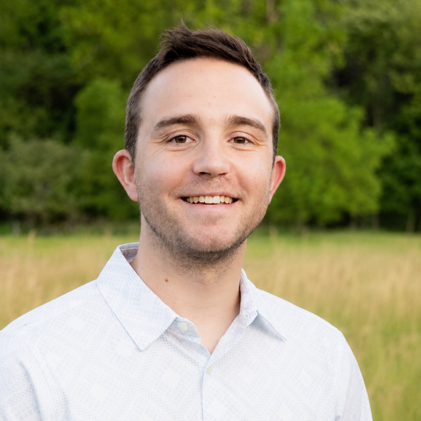

# Daric Meyers

{ width=350px }

---

- **Email**: dgm1997@byu.edu
- **LinkedIn**: [https://www.linkedin.com/in/daric-meyers-51389624b/details/experience/](https://www.linkedin.com/in/daric-meyers-51389624b/details/experience/)
- **GitHub**: [https://github.com/DMeyersBYU](https://github.com/DMeyersBYU)

## About

Daric is a master's student in Electrical and Computer Engineering at Brigham Young University, advised by Dr. Cammy Peterson. He earned a BS in Mechanical Engineering with an aerospace emphasis from BYU.

Daric has been interested in science and engineering since he was young, with access to dedicated engineering classes beginning in fourth grade. During his undergraduate studies, he focused on aerospace engineering and developed an interest in control theory. His senior capstone project was a cross-college drone design challenge that led to an internship with Baxter Aerospace, where he helped with early prototyping and testing for a wildfire surveillance UAV.

After working as a manufacturing engineer at Ram Aviation, Space, and Defense, Daric worked as a systems engineer for a UAV development branch of Lockheed Martin Skunk Works. That experience helped him develop his design and development skills before returning to school to build deeper technical expertise in control and autonomy.

## Research

Daric's research focuses on integrating reasoning capabilities into cooperative UAV control. The work is motivated by the need for autonomous systems to reason over contextual observations and draw conclusions in ways that support more sophisticated collaborative missions.

His current work uses an event memory model called HEMS, the Hybrid Event Memory System, to support customizable, online, temporal context learning with traceable learning processes and downstream information inference. The system also uses Bayesian statistical methods to produce directly interpretable probabilistic outcomes. By incorporating these methods into cooperative UAV control, teams of UAVs can make more informed decisions and adapt automatically to dynamic scenarios.

### Current Projects

Cooperative Reasoning of UAVs in Multi-Objective Missions using Shared Event Memory

## Presentations

- CAAMS July 2025 Presentation, Center for Autonomous Air Mobility and Sensing
- CAAMS February 2026 Presentation, Center for Autonomous Air Mobility and Sensing

## Experience

- Baxter Aerospace, Intern
- Ram Aviation, Space, and Defense, Manufacturing Engineer
- Lockheed Martin Skunk Works, Systems Engineer
