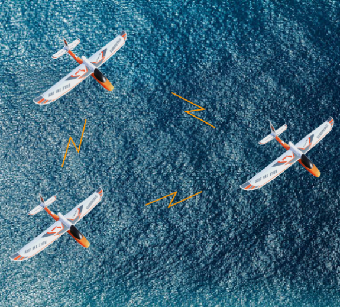

<!--
EDITING GUIDELINES

This page is organized with Material for MkDocs' grid feature.

To add an entry to this page, we need to do two things:
1. Add a project photo and entry to the current_projects.md page.
2. Copy the template project page and fill it with your project information.

To do the first:
Copy the template below and add it inside the <div> HTML blocks, with entries in alphabetical order.
Add an overview picture to docs/research/projects/assets/{your project name}. This photo should be cropped square and about 600x600 in size (to keep webpage page load times quick).

To do the second:
Copy the template.md file in the docs/directory/projects folder, renaming your copy to {project_name}.md. Fill the template with whatever information you'd like to include to show off your project. You can add additional photos to your assets folder and include them there. 

Once you've done this follow the instructions in the README.md to build and host the webpage locally (it's much easier than it sounds) and make sure everything looks good with your additions. Also, check out the documentation for Material for MkDocs to learn about what you can do with your page: https://squidfunk.github.io/mkdocs-material/

All projects, past and current, are found in this directory so their URLs don't change when they get moved from current to past.

TEMPLATE
```
-   [**Project Name**](projects/project_name.md)

    ---

    Single sentence summary of project.

    { width=250px }
```
-->

<div class="grid cards" markdown>

-   [**Cooperative GPS Denied Navigation**](projects/cooperative_gps_denied_nav.md)

    ---

    Cooperative navigation of heterogeneous robotic vehicles utilizing VIO, SLAM, and machine learning technologies.

    { width=300px }

-   [**ROSflight**](https://rosflight.org/)

    ---

    Streamlined, modular UAS autopilot software built specifically for researchers on a ROS2 framework.

    { width=300px }

</div>
