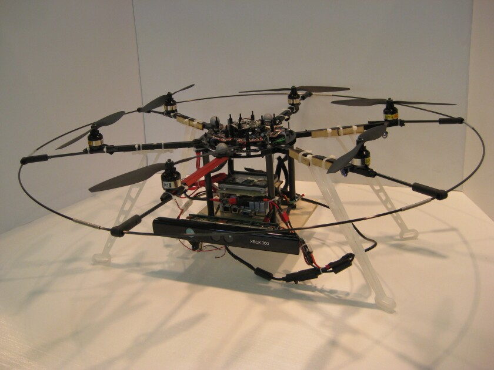

# Indoor Navigation

The Indoor Navigation group of the BYU MAGICC Lab pursues research to enable a fully autonomous air vehicle to search an a priori unknown and complex environment (e.g. The post-earthquake Fukushima nuclear complex or Al Qaeda cave networks). This type of environment imposes significant challenges on the design of the vehicle. We cannot assume anything about the structure of the environment (e.g. vertical walls, flat floors, etc.). We are also denied access to outside navigation aids (e.g. GPS, or radio beacons). An appropriate vehicle will need to be relatively small and agile, and it will need to develop its own representation (i.e. map) of the environment online using its own sensor data.

Several techniques and technologies, each with its own set of design tradeoffs, must be used to address these challenges. Navigating through an unknown environment without external references requires some type of simultaneous localization and mapping (SLAM) algorithm. The complex nature of the environment precludes popular sensors such as 2D scanning laser rangefinders; inherently 3D sensors such as stereo or RGB-D cameras must be used. Finally, any vehicle suitable for this environment will be constrained by its size, weight, and power (SWAP) limitations. Limited computational resources follow as a natural consequence.

We acquired an eight camera motion capture system from Motion Analysis Corp. in the spring of 2010, and our efforts on this project began the following fall. We have adopted the MikroKopter family of multirotor helicopters as our aerial platform. These helicopters are agile, relatively inexpensive, and capable of carrying significant payload for their size. However, multirotor helicopters have undamped dynamics that require accurate estimates of states, especially velocity, be fed back frequently to the autonomous control. In the summer of 2011 we developed a state estimation scheme based on an improved dynamic model that produces accurate state estimates based primarily in high-rate IMU data. The estimates only require infrequent (approx. 5-10 Hz) updates from an exteroceptive sensing algorithm.

We have adopted the Microsoft Kinect® as our preferred exteroceptive sensor. The Kinect provides an RGB image at 30 Hz along with depth data for each pixel measured by an IR emitter and receiver. In the Spring of 2011 and the Spring of 2012 we developed a visual odometry algorithm for the Kinect capable of producing relative position and orientation estimates at nearly 30 Hz. The visual odometry algorithm can be used along with saved images and a place recognition algorithm to develop a locally‑metric, globally‑topological SLAM map sufficient for persistent, repeatable navigation.

We have recently added a [Microstrain 3DM-GX3-15 IMU](http://www.microstrain.com/inertial/3dm-gx3-15), which has helped to improve our estimation results considerably.

Cortex3DGraphic.png
IMG_1333.jpeg
Xbox-360-Kinect-Standalone.png

Our current efforts center on:
- Refining the visual odometry algorithm;
- Integrating the estimator with the real-time control and path planning of the vehicle;
- Developing an innovative approach to back-end optimization that more efficiently creates a globally‑metric representation of the environment.

Most published work on indoor navigation makes strong assumptions about the structure of the environment. We aim to relax these assumptions that others use to allow scanning laser rangefinders or simplified vision processing. The bulk of the literature also describes systems that depend on globally referenced states for navigation; our approach allows globally referenced information to be refined outside of the time critical navigation routines. Future work could involve a variety of tasks such as more sophisticated path planning (e.g. balancing competing mission requirements), higher level behaviors (e.g. interacting with objects in the environment), or cooperation between multiple vehicles.

## Personnel

John Macdonald
Robert Leishman
Stephen Quebe

## Sponsor

This project is primarily funded through the Department of Defense SMART Scholarship program.

## Project Duration

Until we graduate

## Publications

R. Leishman, J. Macdonald, R. Beard, and T. McLain, "Improved Use of Accelerometers in Estimating Quadrotor Attitude and Velcocity" in review for publication in IEEE Robotics and Automation Magazine
R. Leishman, J. Macdonald, T. McLain, and R. Beard, "Relative Navigation and Control of a Hexacopter" in Proc. IEEE Int. Conf. Robotics and Automation, St. Paul MN, 2012

R. Leishman, J. Macdonald, S. Quebe, J. Ferrin, T. McLain, and R. Beard, "Utilizing an Improved Rotorcraft Dynamic Model in State Estimation" in Proc. IEEE Int. Intelligent Robots and Systems, San Fransisco, September 2011.

J. Ferrin, R. Leishman, R. Beard, and T. McLain, "Differential Flatness-Based Control of a Rotorcraft for Aggressive Maneuvers" in Proc. IEEE Int. Intelligent Robots and Systems, San Fransisco, September 2011.
