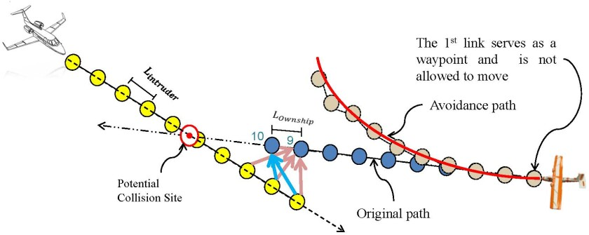

# Sense and Avoid for Unmanned Aircraft Systems

It is obvious that the effective use of Unmanned Aerial Vehicles (UAV) for civilian or military applications requires flight through various civilian, restricted, and military airspace classes. To ensure that UAVs do not disrupt other airspace users, they must be integrated into the current National Airspace System (NAS), through the development of detailed and comprehensive rules, procedures, policies, standards and regulation that allow for safe, accident-free aviation. However proving that UAVs have the capability to provide the Equivalent Level of Safety (ELOS) as manned aviation remains a challengeig issue. Since the beginning of manned flight the primary method for avoiding midair collisions has been a pilot's eyes. Even with the introduction of radio communication, radar, and air trac control (ATC), the FAA has maintained the requirement for a pilot to actively search the sky for other airspace users and maneuver to avoid collision. While creating a robust system to identify intruder aircraft is an integral piece of the SAA problem, the development of a Collision Avoidance System (CAS) is equally important. If UAVs are to be integrated seamlessly alongside piloted aircraft, they must react to collision threats in the same way as a human pilot. In any encounter scenarios that occurs, the UAV's avoidance maneuver must conform to the standard fight rules followed by piloted aircraft.This work will aim to develop and implement a collision avoidance approach based on a chain placed in a force field. The chain-based strategy was initially presented by MAGICC lab researchers to plan a path as a planner that models the UAV path using a series of connected waypoints. The waypoints serve as the links of a simulated chain. The chain is placed in a force-field generated using the gradient of a bounded differentiable reward function. This causes each link in the chain to move toward local maxima of the reward function. Other forces are applied to prevent UAV fight constraints from being violated. Since the path is represented using waypoints that are a fixed distance apart, it is easy to determine roughly where the UAV will be at any given time. This timing information can be used to prevent collisions and spread out paths when creating plans for multiple UAVs.

## Personnel

- Dr. Randy Beard
- Dr. Tim Mclain
- Laith Sahawneh
- Robert Klaus

## Sponsor

This project is funded by Utopia Compression Corporation and Air Force Research Laboratory.

## Project Duration

January 2012 - December 2012

## Publications

[1] Sahawneh, Laith, Beard, Randal W., Avadhanam, Sharath, Bai, He. "Chain-based Collision Avoidance for UAS Sense-and-Avoid Systems", AIAA Guidance, Navigation, and Control Conference, Boston, August, 2013.
