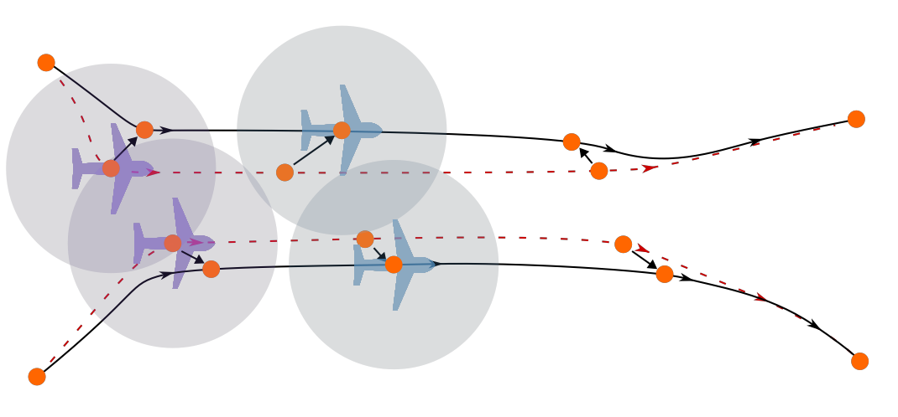

# 4D Flight Path Conflict Detection and Resolution

Trajectory-based operations require aircraft to share and follow time-parameterized flight intent. This project develops 4D flight path models and conflict detection and resolution methods for autonomous aircraft operating in shared airspace.

The flight paths are represented with fifth-order polynomial splines defined by enhanced waypoints. Each waypoint specifies position, velocity, acceleration, and time, allowing the full trajectory to be evaluated continuously. This compact representation makes it possible to reason directly about where an aircraft will be and when it will be there.

The project uses the polynomial structure of the trajectories to rapidly detect loss-of-separation events with Sturm sequences. When a conflict is detected, affected flight-path segments are adjusted using constrained optimization to maintain required separation while minimizing deviation from the original route.

Recent hardware experiments implemented the approach on quadrotor platforms using Raspberry Pi onboard computers, Pixhawk autopilots, PX4, and ROS 2. Flight tests demonstrated real-time conflict detection and resolution between multiple quadrotors and showed that commercial off-the-shelf autopilots can track the generated 4D flight paths.

{ width="100%" }

## Sponsors

- 4D Avionics, LLC

## Personnel

### Students

- Michael Klinefelter
- Matt Osburn

### Faculty

- [Cammy Peterson](../../directory/faculty.md)

### Collaborators

- [John Salmon](https://www.me.byu.edu/faculty/johnsalmon)

## Significant Results

- Developed a 4D flight path representation using fifth-order polynomial splines defined by position, velocity, acceleration, and time.
- Used Sturm sequences to rapidly detect pairwise loss-of-separation events along continuous-time polynomial trajectories.
- Developed constrained optimization methods that resolve conflicts while minimizing deviation from the originally planned flight paths.
- Demonstrated distributed conflict detection and resolution on large simulated airspace scenarios, including multi-vehicle simultaneous conflicts and real ADS-B-derived trajectories.
- Implemented the 4D flight path tracking and conflict-resolution workflow on quadrotor hardware using Raspberry Pi onboard computers, PX4, Pixhawk autopilots, and ROS 2.
- Validated that commercial off-the-shelf quadrotors can track 4D flight paths and execute resolved trajectories in outdoor flight tests.

## Papers

- [Distributed Conflict Detection and Optimal 4D Trajectory Resolution Leveraging Polynomial Based Methods](https://scholarsarchive.byu.edu/studentpub/388/)
- [Conflict Detection, Resolution, and Control of Aircraft using 4D Polynomial Splines](https://doi.org/10.23919/ACC63710.2025.11107516)
- [Optimization of 4D Splines for Unmanned Aerial System Trajectories Under Kinematic, Obstacle, and Time Constraints](https://arc.aiaa.org/doi/abs/10.2514/6.2025-2230)
