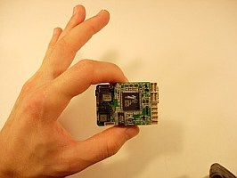

# Autopilot Design

The main objective of this research group has been to develop a working autopilot platform for mini-unmanned air vehicles (MUAV) that would allow for testing and development of commercial products.

In recent years, a great deal of research has resulted in the Kestrel autopilot (KAP) which BYU uses for its various unmanned aircraft. The Kestrel uses a Rabbit Microprocessor which is programmed with all the code necessary to coordinate onboard electronics with the ground station. The autopilot is getting ever smaller, with the most recent version weighing just 16 grams and measuring less than 2 in X 2 in.

The Kestrel autopilot has been developed into a commercial product available for purchase through Procerus small autopilot Technologies. BYU's MAGICC lab and senior capstone projects have been crucial in the development and production of these conveniently small autopilot chips that are being used by the Air Force.

pda-demo-short_clip_big.jpg
While the plane can be flown entirely by the autopilot, commands are sent to the plane through a ground station which consists of a laptop computer, a modem, and an optional video receiver. The laptop computer uses a software program called Virtual Cockpit to control the plane's path and to receive telemetry data from the plane. Virtual Cockpit has evolved into a robust program, capable of controlling multiple planes in a single console, and has even been adapted to be run off of a PDA (Portable Digital Assistant) as shown in the movie at right (Click to watch).

Recently, the Magicc autopilot has increased its auto-takeoff and auto-land capabilities. This feature makes it possible for each plane to be autonomous from the beginning to the end, ending the need for RC control during UAV missions. Just throw the plane and click the mouse, and the Zagi flies its mission. The pictures below are links to videos that demonstrate the auto-takeoff and auto-land features.

Currently, the autopilot is based off of PID feedback control loops and manual gain-tuning. However, Josh Matthews, a graduate student, has recently developed adaptive control algorithms to automatically tune gains and has incorporated this into the autopilot code. Adaptive control allows the planes to fly without having to specify each of the gains. This vastly diminishes prep time and gives the planes the capability to respond to instantaneous problems in real-time. The algorithms he is using allow planes to adapt to conditions such as a broken aileron or a shift in weight.

