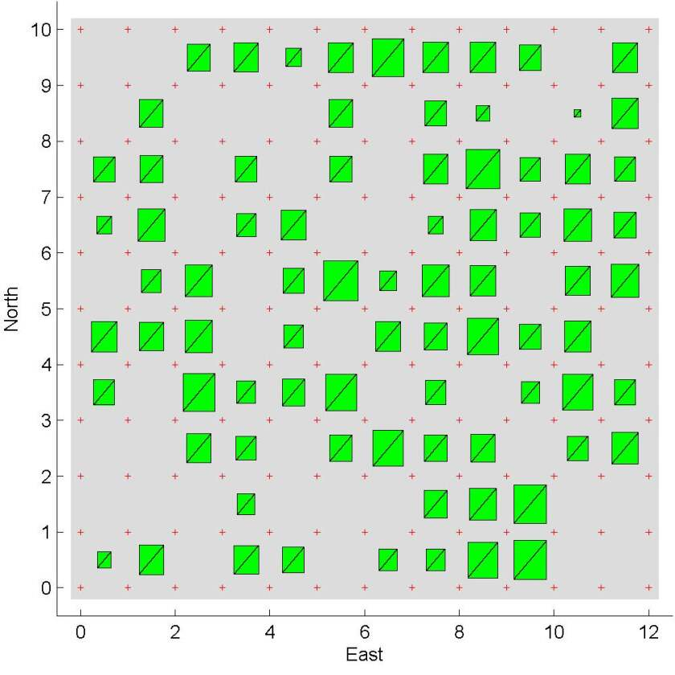

# Cooperative Control with Learning

Unmanned aerial systems (UAS) are increasingly seen as a cornerstone in developing the future defense infrastructure. Because UASs are contributing members this infrastructure, it is critical that they collaborate efficiently as part of a larger manned-unmanned team. Successful cooperative control solutions are needed for greater autonomy and improved collaboration of unmanned systems. The difficulty with current cooperative control solutions is that they lack the ability to learn or to improve performance of mission objectives. Without the ability to learn, a UAS may not adapt to dynamically changing environments which may result in poor mission performance or even mission failure.
Multi-agent learning has been studied in the computer science (CS) community for a long time. The learning approaches that have come out of the CS community may not be suitable for real world challenges since real applications require large state space models. Also, much of the existing work demonstrates learning capabilities with a limited number of cooperative agents. Our work seeks to solve these limitations by combining the multi-agent learning and the cooperative control fields.

We will develop a hierarchical learning framework to enhance intelligence of cooperative multi-agent systems. This framework, once fully developed, will be a positive step towards the envisioned manned-unmanned teams working together with confidence. To this end, we will develop a city-like environment for the UASs to learn and a baseline system for performance measurement. We will develop and test multi-agent cooperative control algorithms that help to maximize learning and improve mission performance. Finally, we will write low-level learning algorithms to account for mission objectives and high-level learning algorithms to ensure mission success.

## Personnel

- Dr. Randy Beard
- Dr. Kevin Seppi
- Everett Bryan
- Kevin Cook

## Sponsor

This project is funded by the UtopiaCompression Corporation and the AFRL Air Vehicles Directorate.

## Project Duration

May 2012 - December 2012

## Publications

Expected Publications - September 2012
