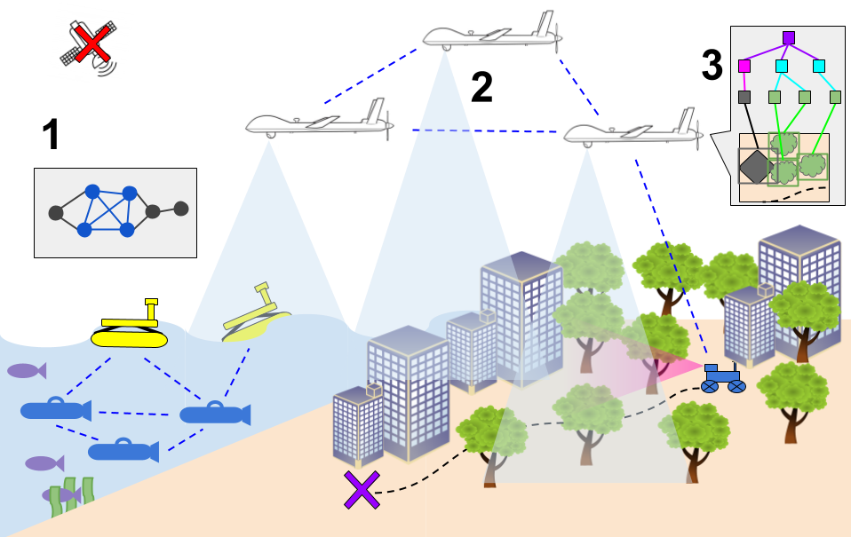
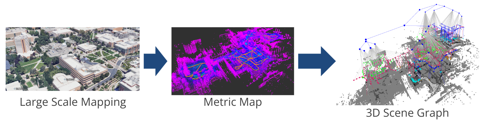

# Cooperative GPS-Denied Navigation

Localization can be difficult when GPS signals are corrupted or lost due to adversarial spoofing, jamming, or environmental conditions such as underground, underwater environments, or urban canyons.
We are researching how multi-agent systems can be used to improve localization estimates by efficiently covering larger areas, reducing uncertainty through shared sensor data, and creating a comprehensive representation of unknown environments from various perspectives.

This research is done in collaboration with the [BYU FRoSt Lab](https://frostlab.byu.edu/).

## Research Areas

### 1 - Multi-agent Localization with Outlier Rejection

The presence of outliers in sensor measurements can severely degrade localization estimates.
Group-k consistent set maximization (GkCM) can be used to perform outlier rejection for lower degree-of-freedom (DoF) measurements, but is not as well studied as its pairwise counterpart.
We do research in GkCM and also address outlier rejection for bearing-only measurements, with applications to acoustic, camera, RF, and signals of opportunity sensor measurements.

### 2 - Multi-agent Localization with Existing Single-agent Vehicles

Existing single-agent systems need a method of being incorporated into cooperative localization frameworks that fully utilizes the single-agent’s existing estimator performance without degrading it or requiring significant modification of the filter.
We are researching methods of easily integrating diverse multi-agent measurement types in extended Kalman filter estimators.

### 3 - Semantic Mapping and Multi-View Localization Using Heterogeneous Teams

A heterogeneous multi-agent team enables efficient mapping and cross-view localization.
A semantic, hierarchical, and sparse map representation (3D Scene Graph) allows for data-efficient storage and transfer, supporting high-level intelligent robotic tasks and enabling robust cross-view localization.

## Sponsors

- [Center for Autonomous Air Mobility & Sensing](https://caams.center/)
- [Air Force Research Laboratory](https://www.afrl.af.mil/)

## Personnel

### Students

- Brendon Forsgren
- [Chad Samuelson](https://frostlab.byu.edu/directory/chad-samuelson)
- [Kalliyan Velasco](https://frostlab.byu.edu/directory/kalliyan-lay)
- [Brandon Sutherland](../../directory/students/brandon_sutherland.md)
- Gabe Snow
- [Jacob Moore](../../directory/students/jacob_moore.md)

### Faculty

- [Tim McLain](../../directory/faculty.md)
- [Joshua Mangelson](https://frostlab.byu.edu/directory/joshua-mangelson)

## Papers

- [Group-k Consistent Measurement Set Maximization for Robust Outlier Detection](https://doi.org/10.1109/IROS47612.2022.9982057)

