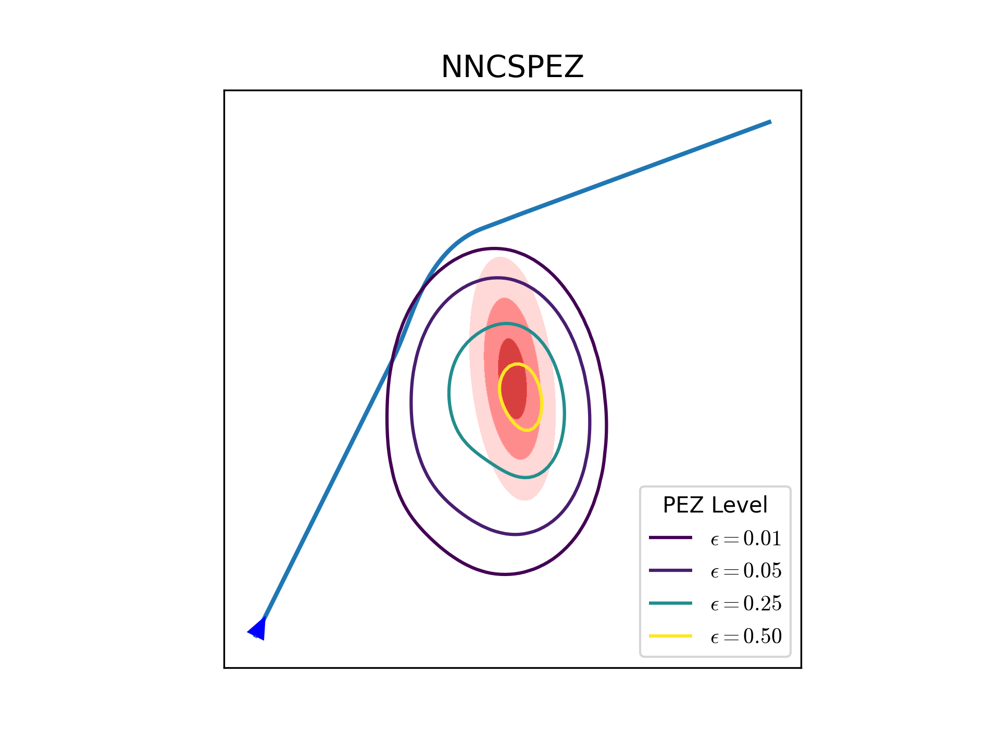

# Explore Now, Exploit Later: Optimal UAS Fleet Coordination for Environmental and Adversarial Threats

Autonomous aircraft operating in uncertain environments must decide when to gather information and when to use that information to complete the mission. This project develops planning and dispatch algorithms for UAS fleets that balance exploration of unknown threats with exploitation of the best current threat estimate.

The work considers both environmental hazards, such as disaster-zone risks and contaminants, and adversarial threats, such as radar detection and weapon engagement regions. Low-priority vehicles can be used to explore, localize, or infer uncertain threats, while high-priority vehicles use the resulting information to plan safer and more efficient routes.

Recent work has developed bi-level route optimization and path planning methods for hazard monitoring. At the fleet-routing level, UAVs are assigned routes to visit known hazards while allocating remaining battery budget for exploration. At the trajectory-planning level, smooth B-spline paths use Bayesian inference to reduce uncertainty about hidden hazards and prioritize regions where new threats are likely to be found.

The broader project also develops risk-aware planning methods for adversarial settings, including probabilistic engagement zones, radar detection avoidance, and sacrificial-agent learning strategies that infer uncertain threat models before routing high-priority assets.

{ width="100%" }

## Sponsors

- [Center for Autonomous Air Mobility & Sensing](https://caams.center/)

## Personnel

### Students

- [Grant Stagg](../../directory/students/grant_stagg.md)

### Faculty

- [Cammy Peterson](../../directory/faculty.md)

### Collaborators

- Max Li, Assistant Professor at the University of Michigan
- Jimin Choi, PhD student in Aerospace Engineering at the University of Michigan

## Significant Results

- Developed a bi-level framework that integrates high-level UAV route optimization with low-level path planning for environments containing known and unknown hazards.
- Introduced edge-based centroidal Voronoi tessellation to add pseudo-nodes that improve spatial coverage during route planning.
- Allocated remaining battery path budget across route segments using line-segment Voronoi regions to support local exploration.
- Developed Bayesian, information-seeking B-spline path planning methods that improve unknown-hazard discovery compared with straight-line and lawnmower baselines in simulation.
- Developed engagement-zone modeling and inference methods that allow low-priority agents to gather information about adversarial threats before high-priority agents plan risk-aware routes.

## Papers, Theses, and Presentations

- [Bi-Level Route Optimization and Path Planning with Hazard Exploration](https://arxiv.org/abs/2503.24044)
- [Engagement Modeling and Inference for Risk-Aware Path Planning Under Adversarial Uncertainty](https://scholarsarchive.byu.edu/etd/11268/)
- [Cooperative Multi-Agent Path Planning for Heterogeneous UAVs in Contested Environments](https://arxiv.org/abs/2509.02483)
- [Inferring Turn-Rate-Limited Engagement Zones with Sacrificial Agents for Safe Trajectory Planning](https://arxiv.org/abs/2602.13457)
