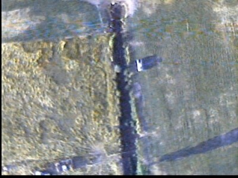
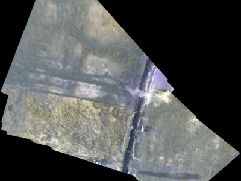
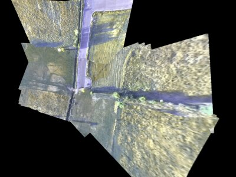
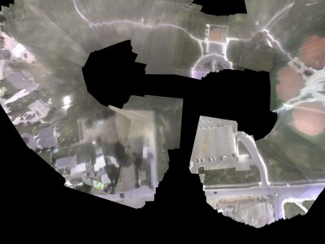

# Geo-referenced Mosaics

Miniature UAVs (MAVs) have recently become a popular and inexpensive way to collect visual data about an area. However, there are some significant challenges associated with this data. The small size and weight of an MAV make it very susceptible to atmospheric turbulence. This makes the video captured by an MAV shaky and difficult to watch. Another significant challenge occurs due to the limited field of view typical of MAV imagery. This makes it difficult for an operator to maintain context of what is being seen in the video transmitted from an MAV. For instance, when viewing MAV video, it is difficult to determine the relative or absolute location of features in view or even to determine which direction in the video is North.

The usefulness of MAV imagery can be significantly improved by combining still images or video frames with position information from the MAV autopilot to create a geo-referenced mosaic. The mosaic presents everything the MAV has seen in one view and contains geographic information which allows any point in the view to be accurately geo-located. In addition, if the mosaic is created and updated in real-time, the operator can see live video on the mosaic with none of the shaking and limited field of view problems.

### Example of raw vs. mosaicked videos

These videos further demonstrate the advantages of mosaics over raw video:

[Raw video](http://www.et.byu.edu/groups/magiccuav/Mosaic/TargetHomeFromHomeLoiter-1.wmv) - Captured at 30 frames per second with 640x480 resolution

[Mosaicked video](http://www.et.byu.edu/groups/magiccuav/Mosaic/mosaic2-1.wmv) - Mosaic created at 10 frames per second on a laptop with a 1.8 GHz Pentium M processor

### Other example mosaics

## Current Research

In addition to improving imagery display for a single MAV, geo-referenced mosiacs are an excellent way to combine video from multiple MAVs in one view. This allows an operator to monitor multiple MAVs at a single glance, while still being able to zoom in to get get a close-up look at any particular image. We have implemented and flight tested such a system using three MAVs. Some images captured during testing of the system are shown below.

Mosaic and satellite image from a single MAV, zoomed in to show detail

Mosaics from multiple MAV locations, overlayed on a satellite image, zoomed out to show context between locations.

Currently we are implementing a system which allows users to track the progress of an MAV in real-time from anywhere in the world using the Internet and Google Earth(tm). The MAV ground station receives video and telemetry from the MAV and process them to create a geo-referenced mosaic. MAV status information as well as mosaics are periodically uploaded to a webserver by accessing the internet via a commercial cellular network. The webserver, in turn, process the received information and uses it to update a Google Earth(tm) overlay showing all of the collected imagery as well as the current position and status of the MAV.
