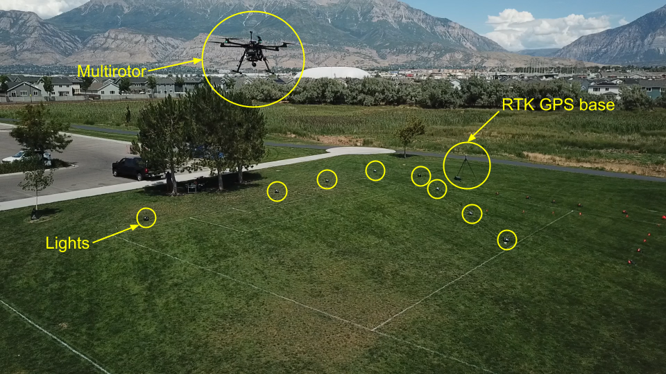

# Infrared-Constellation-Aided Landing of eVTOL Aircraft

Advanced air mobility (AAM) seeks to enhance the capabilities of manned and unmanned aircraft to improve quality of life.
One focus of AAM research (and several companies) is to develop eVTOL air taxis to revolutionize urban transport.
Safety is critical for such objectives.
One critical component to ensure safety is accurate navigation during the landing phase, especially when operating in complex and congested urban environments.

GPS signals are crucial for most navigation problems, due to the ability of GPS to provide highly accurate global position.
Urban environments, however, often suffer from degraded GPS reception, due to multipathing.
Thus, navigation without GPS or with intermittent or degraded GPS signal is important to ensure safety.

In this project, we developed a method to use a constellation of infrared lights to aid the landing of an eVTOL aircraft (multirotor).
We demonstrated the proposed method on real hardware, showcasing the ability of the method to safely land aircraft even when GPS is not available or intermittent.

## Sponsors

- Archer Aviation

## Personnel

### Students
- Aaron Brown
- David Akagi
- [Brandon Sutherland](../../directory/students/brandon_sutherland.md)
- Ian Reid
- [Jacob Moore](../../directory/students/jacob_moore.md)

### Faculty
- [Tim McLain](../../directory/faculty.md)

## Significant Results

- Developed a method for robust data association to detect the light constellation.
- Designed an EKF that fused relative pose information from detected light constellation.
- Successfully demonstrated safe landing of the multirotor.

## Photos

{ width="500" }

## Papers

- [Infrared-Constellation-Aided Landing of eVTOL Aircraft (AIAA SciTech 2025)](https://arc.aiaa.org/doi/10.2514/6.2025-1538)
