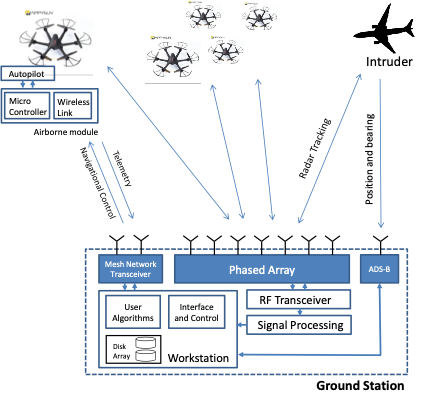

# LATIS

The Local Air Traffic Information System (LATIS) is a networked radar system designed to help safely integrate small unmanned aircraft systems into low-altitude airspace. As small UAS become more common in populated areas, airspace managers need independent sensing systems that can track aircraft even when onboard broadcast information is unavailable, incorrect, or unverified.

LATIS uses multiple ground-based phased-array radars to detect and track small UAS. The radars report detections to a common tracking system, where detections are calibrated into a shared reference frame, fused across the radar network, and processed with recursive RANSAC to reject clutter and estimate target tracks.

One key challenge in networked radar is calibration. Each radar must be aligned with the common frame before detections from multiple sensors can be fused. This project developed batch and online calibration methods based on the orthogonal Procrustes problem, allowing the network to maintain accurate tracking even when radar alignment changes during operation.

Hardware tests demonstrated that LATIS can track multiple small UAS in real time using a network of low-cost phased-array radars. The online calibration method improved robustness to physical disturbances, and the full network achieved sub-meter average tracking error in the reported field experiments.

{ width="100%" }

## Sponsors

- [National Science Foundation](https://www.nsf.gov/)

## Personnel

### Students

- Brady Anderson
- Doug Graff
- Michael Eyler
- David Buck

### Faculty

- [Cammy Peterson](../../directory/faculty.md)
- [Tim McLain](../../directory/faculty.md)

### Collaborators

- [Karl Warnick](https://ece.byu.edu/directory/karl-warnick)

## Significant Results

- Developed a LATIS radar sensor network for real-time tracking of small UAS.
- Integrated multiple phased-array radars into a common-frame tracking system.
- Used recursive RANSAC to reject clutter, fuse radar detections, and track multiple targets.
- Developed batch and online extrinsic calibration methods using the orthogonal Procrustes problem.
- Demonstrated that online calibration is more robust than batch calibration when physical disturbances change radar alignment.
- Validated the system in hardware flight tests, with the combined radar network achieving less than 1 m average tracking error in the reported experiments.

## Papers

- [Online Calibration for Networked Radar Tracking of UAS](https://doi.org/10.1007/s10846-024-02186-0)
- [Networked Radar Systems for Cooperative Tracking of UAVs](https://doi.org/10.1109/ICUAS.2019.8797749)
- [Decentralized UAV Tracking with Networked Radar Systems](https://arc.aiaa.org/doi/abs/10.2514/6.2021-1160)
