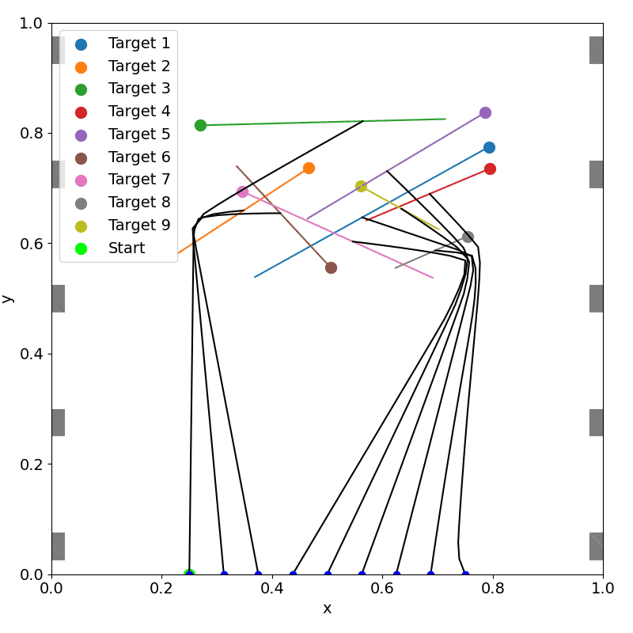

# Space-Time Graph of Convex Sets

Space-Time Graphs of Convex Sets (ST-GCS) extend graph-of-convex-sets motion planning into time-varying environments. The goal of this project is to generate safe, optimal trajectories for autonomous vehicles operating around moving obstacles, moving tasks, and cluttered airspace without requiring a hand-built initial guess for the optimizer.

Traditional graph search methods can find global routes, but they often ignore smoothness, continuity, and timing constraints. Continuous trajectory optimization can enforce those constraints, but it can be sensitive to initialization and local minima. Graphs of Convex Sets combine these ideas by searching over a graph of convex free-space regions while simultaneously optimizing continuous trajectory variables.

This project develops systematic methods for writing GCS-compatible trajectory constraints and applies them in space-time. By treating time as an explicit planning dimension, ST-GCS can reason about not only where a vehicle should move, but when it should move through each region of the environment.

Recent work also couples ST-GCS with the Consensus-Based Bundle Algorithm (CBBA) for multi-agent task allocation. In that framework, agents bid on tasks using trajectory costs computed by ST-GCS, allowing allocation decisions to account for dynamic obstacles, moving task locations, timing feasibility, and collision-free execution.

{ width="100%" }

## Sponsors

- 4D Avionics, LLC

## Personnel

### Students

- Matthew Osburn

### Faculty

- [Cammy Peterson](../../directory/faculty.md)

### Collaborators

- [John Salmon](https://www.me.byu.edu/faculty/johnsalmon)

## Significant Results

- Developed a systematic strategy for formulating vertex and edge constraints for the Graphs of Convex Sets framework.
- Extended GCS planning to space-time environments so dynamic obstacles can be handled directly in the optimization problem.
- Demonstrated that ST-GCS reproduces standard GCS trajectories in static environments while enabling collision-free planning in dynamic environments.
- Generated globally optimal minimum-distance trajectories through cluttered dynamic environments without requiring an initial spatial or temporal guess.
- Extended ST-GCS to 3D+time multirotor planning with velocity, causality, timing, obstacle-avoidance, and moving-task constraints.
- Integrated ST-GCS with CBBA so distributed agents can allocate tasks using motion-aware bids instead of simplified distance estimates.

## Papers

- [Systematic Constraint Formulation and Collision-Free Trajectory Planning Using Space-Time Graphs of Convex Sets](https://arxiv.org/abs/2508.10203)
- [Task Allocation and Motion Planning in Dynamic, Cluttered Environments via CBBA and Graphs of Convex Sets](https://arxiv.org/abs/2606.18516)
