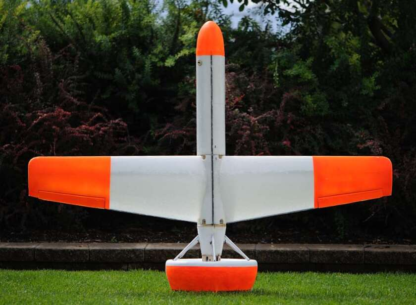

# Tailsitter

A tailsitter is a fixed wing aircraft with vertical takeoff and landing (VTOL) capabilities but requires no additional moving parts as tilt-rotor, tilt-wing or vectored thrust aircraft do. This type of aircraft combines the flexibility of rotorcraft and endurance of fixed-wing aircraft. (See http://en.wikipedia.org/wiki/Tailsitter for more details.)

## Problem Statement

Autonomous flight desired from takeoff through landing, including transition between hover and level flight
Platform must be robust to external disturbances such as wind during all flight regimes.

## Challenges

Aircraft inherently unstable in hover
Characterizing aerodynamics during transition
Traditional methods of attitude description (Euler Angles) not sufficient
Maintaining control authority while descending during hover

## Goals

Hardware-in-the-Loop Simulation o Interface Kestrel 3 Autopilot with the X-Plane flight simulator
Control Algorithms o Implement previously developed control algorithms on Kestrel 3 Autopilot o Validate algorithm robustness to external disturbances, specifically during hover and landing o Improve transition controller: - Banking during transition - Minimize altitude gain while controlling horizontal position
System Identification o Wind tunnel testing for general aircraft parameters o Flight Testing for aerodynamic and other physical parameter o Simulator Validation

## Personnel

BYU: Dr. Randy Beard, Dr. Tim McLain, Matthew Argyle, Nathan Edwards, and Jason Beach

MLB Company: Steve Morris www.spyplanes.com

## Sponsor

MLB was recently awarded a Phase II contract from the Air Force Research Lab. MLB has chosen BYU to develop the flight controls.

